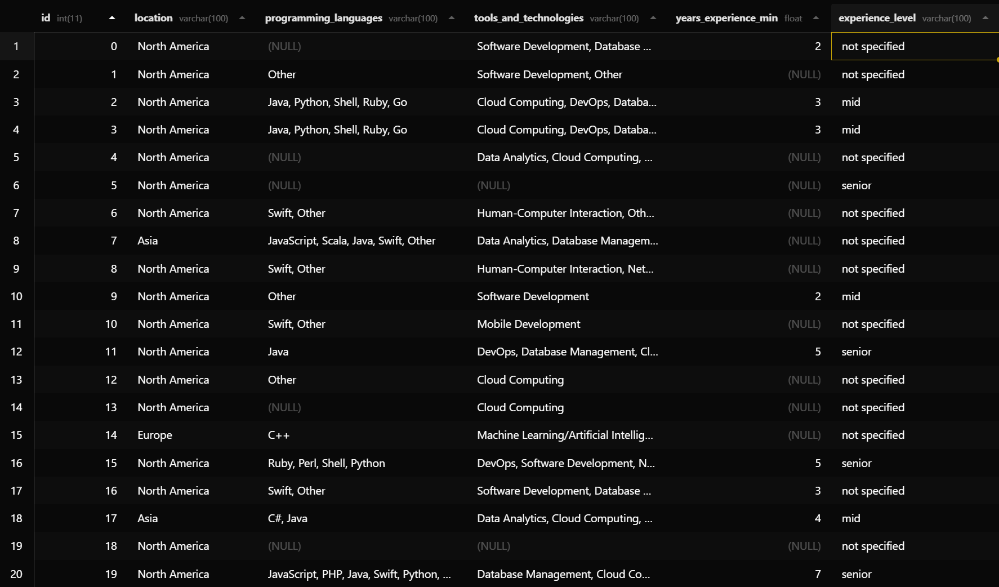

<div align="center">
    
    <h1>Apple Jobs Dataset</h1>
    <h3>Data Cleaning & Preprocessing Pipeline</h3>
    <h4>Kaggle Raw Data EDA Project</h4>

   [Lorenzo Rizzo](https://github.com/BraHKet)
</div>

## Project Overview

This repository documents a data engineering project built around a raw, unstructured dataset of Apple job postings from Kaggle. The primary objective is to demonstrate a reproducible preprocessing pipeline capable of transforming free-form text into a clean, structured dataset ready for analysis. This includes LLM-based feature extraction using OpenAI Structured Outputs, multi-step normalization via LLM bucketing, and final storage in a relational database. The resulting dataset, not the raw input, is the main deliverable of this project.

The dataset used is: 
[**Raw Data**](https://www.kaggle.com/datasets/aesophor/raw-data/code) - *Note: This dataset was chosen specifically for its raw and uncleaned nature.*

## The Data Challenge

The raw dataset presented significant preprocessing challenges. Each job posting 
stored all information as unstructured free-form text, with no consistent 
formatting or separators between fields.

For example, a single `min_qualifications` entry looked like this:
```
2-5 years experience supporting or deploying application software for internal 
and external customers.
Experience configuring or maintaining commercial enterprise application software 
packages (for example: inventory systems, manufacturing systems, PDM, ERP, LIMS, etc…)
Experience providing first level software support to end users and issue triage
Proven problem solving and debugging skills
Comfortable with modern IT tech-stack concepts
Ability to navigate in a Linux/Unix environment
Able to train small and large groups
Able to write and execute basic database queries
You will be self directed, analytical, and work well in a team environment
Be a strong advocate for improving processes and a clear communicator of new ideas
Strong verbal interpersonal skills
Highly organized, ability to juggle multiple priorities at a time
Ability to quickly learn new software applications
```

Extracting structured features, programming languages, experience level, tools, 
job category, from hundreds of entries like this required iterative work involving different mothods.

> The resulting `clean_applejobs.csv` is not a starting point: it is the main output of this project.

## Current Database Snapshot

Below is a preview of the `clean_applejobs.csv` data after import and cleaning. 
This illustrates the structured format with columns properly separated and ready for analysis.

<div align="center">
    
</div>


## Methodology

My approach to this project is guided by a systematic EDA process designed to extract maximum value from challenging datasets. The detailed methodological steps are fully documented in the **[Metodology](EDA_Methodology.md)** file.

---

## Project Structure

The repository is structured as follows:

*   `.ipynb_checkpoints/`: Jupyter Notebook checkpoints.
*   `data/`: Contains processed datasets and generated visualizations.
    *   `clean_applejobs.csv`: The cleaned and preprocessed dataset used for the Apple Jobs Skills Analysis.
    *   `plots/`: Directory where the visualizations generated from the analysis are saved.
*   `.gitignore`: Specifies intentionally untracked files to ignore.
*   `EDA_Methodology.md`: Detailed documentation of the Exploratory Data Analysis methodology.
*   `README.md`: This file, providing an overview of the project.
*   `exploratory_analysis_log.ipynb`: The main Jupyter Notebook for exploratory data analysis and specific project tasks.

---

## Specific Analysis: Apple Jobs Skills in North America

This section details a targeted analysis performed on a cleaned dataset derived from the raw data (specifically, `clean_applejobs.csv`). The focus here is to extract actionable insights regarding job requirements at Apple, with a specific emphasis on opportunities in **North America**.

### Questions We Aim to Answer Using the Data:

This analysis aims to provide a clear and practical guide for anyone aspiring to join the Apple team in North America by answering these crucial questions:

---

<h1>1. Which programming languages are most in demand?</h1>
    <p>We identify the top 10 programming languages that appear most frequently in Apple's job postings in North America, providing a percentage of their mentions. This helps aspiring candidates understand which languages to prioritize in their studies.</p>


---

<h1>2. Which tools and technologies are priority skills?</h1>
    <p>We explore the top 10 most frequently mentioned tools and technology areas. This information is vital for those looking to align their skills not only with programming languages but also with the preferred tech stacks and application domains at Apple.</p>


---

<h1>3. What is the expected level of experience?</h1>
    <p>We analyze the distribution of required experience levels (Junior, Mid, Senior) and calculate the average minimum years of experience. This provides a clear picture of the candidate profile Apple typically seeks.</p>


---

## Limitations & Scope

This project is scoped intentionally as a preprocessing pipeline, not a full analytical study. The dataset presents inherent limitations that constrain deeper analysis: job locations are heavily skewed toward Cupertino, reducing the value of geographic comparisons, and the available structured features are few once free-text fields are parsed. Rather than forcing superficial insights from limited data, the analytical section is kept deliberately concise. The value of this project lies in the pipeline itself, the ability to take genuinely messy, unstructured data and produce something queryable and useful.
