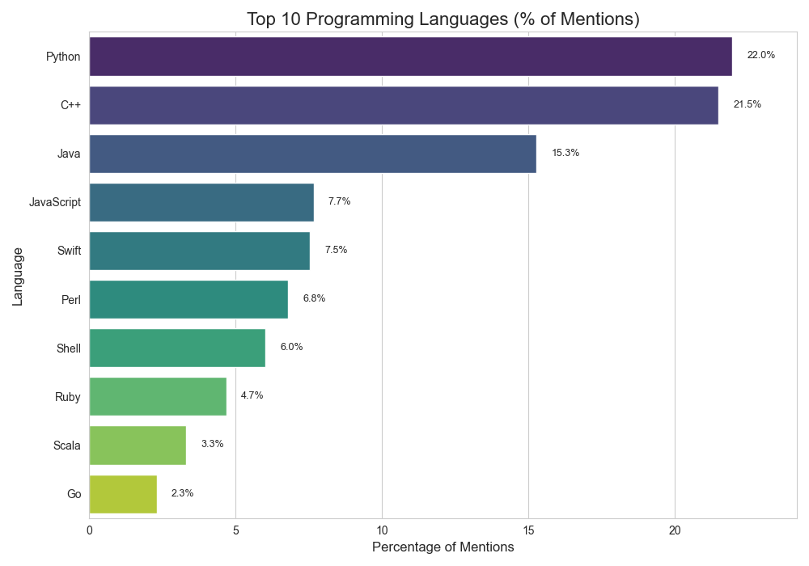
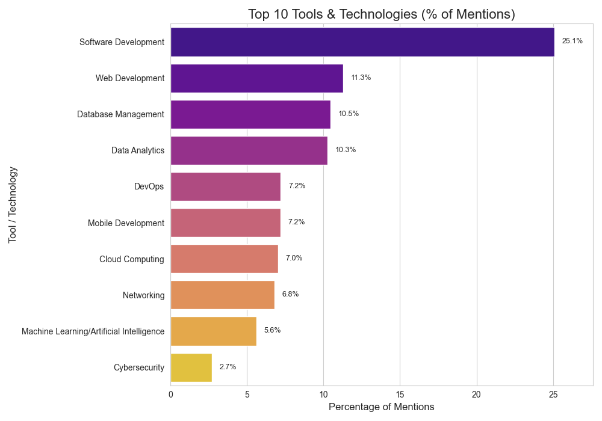
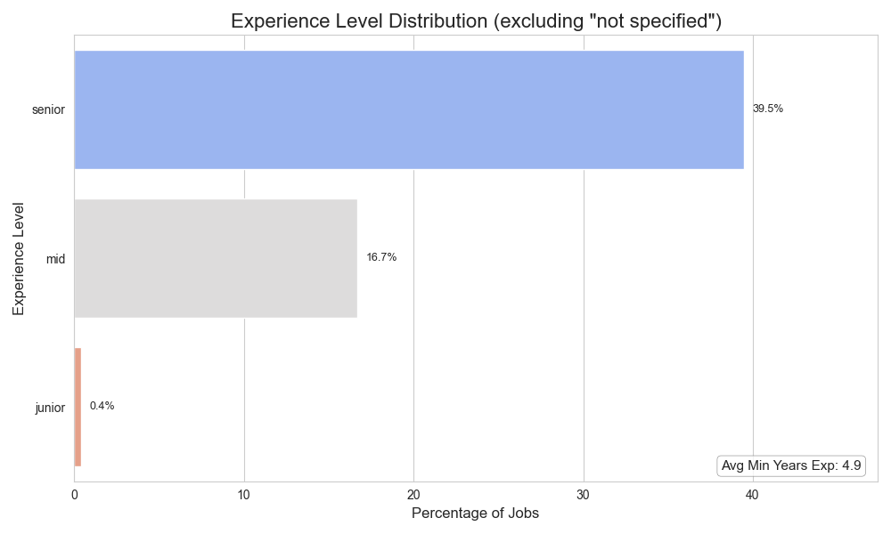

    
    <h1>APPLE JOBS ANALYSIS</h1>
    <h3>Kaggle Raw Data EDA Project</h3>

   [Lorenzo Rizzo](https://github.com/BraHKet)

## Project Overview

This repository presents a data analysis project, focusing on a raw and challenging dataset from Kaggle. The primary objective is to demonstrate a structured approach to Exploratory Data Analysis (EDA) and data cleaning, transforming an initial messy dataset into a clean, insightful foundation for potential future machine learning models.

The dataset used is: 
[**Raw Data**](https://www.kaggle.com/datasets/aesophor/raw-data/code) - *Note: This dataset was chosen specifically for its raw and uncleaned nature.*

## Methodology

My approach to this project is guided by a systematic EDA process designed to extract maximum value from challenging datasets. The detailed methodological steps are fully documented in the **[Metodology](EDA_Methodology.md)** file.

---

## Project Structure

The repository is structured as follows:

*   `.ipynb_checkpoints/`: Jupyter Notebook checkpoints.
*   `data/`: Contains processed datasets and generated visualizations.
    *   `clean_applejobs.csv`: The cleaned and preprocessed dataset used for the Apple Jobs Skills Analysis.
    *   `plots/`: Directory where the visualizations generated from the analysis are saved.
*   `.gitignore`: Specifies intentionally untracked files to ignore.
*   `EDA_Methodology.md`: Detailed documentation of the Exploratory Data Analysis methodology.
*   `README.md`: This file, providing an overview of the project.
*   `exploratory_analysis_log.ipynb`: The main Jupyter Notebook for exploratory data analysis and specific project tasks.

---

## Specific Analysis: Apple Jobs Skills in North America

This section details a targeted analysis performed on a cleaned dataset derived from the raw data (specifically, `clean_applejobs.csv`). The focus here is to extract actionable insights regarding job requirements at Apple, with a specific emphasis on opportunities in **North America**.

### Questions We Aim to Answer Using the Data:

This analysis aims to provide a clear and practical guide for anyone aspiring to join the Apple team in North America by answering these crucial questions:

---

<h1>1. Which programming languages are most in demand?</h1>
    
We identify the top 10 programming languages that appear most frequently in Apple's job postings in North America, providing a percentage of their mentions. This helps aspiring candidates understand which languages to prioritize in their studies.

---

<h1>2. Which tools and technologies are priority skills?</h1>
    
We explore the top 10 most frequently mentioned tools and technology areas. This information is vital for those looking to align their skills not only with programming languages but also with the preferred tech stacks and application domains at Apple.

---

<h1>3. What is the expected level of experience?</h1>
    
We analyze the distribution of required experience levels (Junior, Mid, Senior) and calculate the average minimum years of experience. This provides a clear picture of the candidate profile Apple typically seeks.

---

## Future Developments

This project lays a solid foundation for understanding job market trends. To further enhance this analysis and extract deeper insights, several future developments are envisioned:

*   **Interactive Dashboards with Tableau:** Leverage business intelligence tools like Tableau to create interactive dashboards.

*   **Advanced Analysis with LLMs:** Future work could involve more sophisticated processing of raw textual data to extract more insights.

These future enhancements would transform the current exploratory analysis into a more comprehensive tool for career planning.
